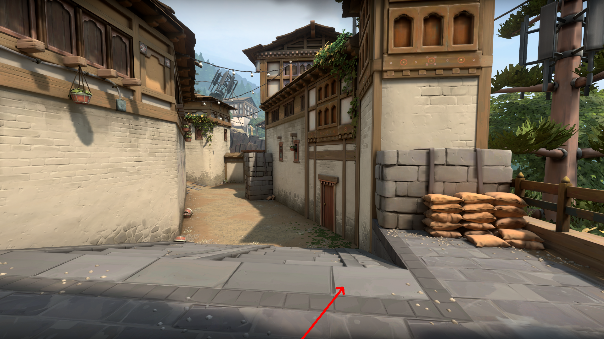

# Camera Pose in img2 w.r.t. img1
## Rotation(Rx, Ry, Rz) in Radians
 [ 8.05582970e-04]  
 [-5.72818571e-04]  
 [-1.09753666e+00]  
## Rotation(Rx, Ry, Rz) in Degrees
 [ 4.61565042e-02]  
 [-3.28200865e-02]  
 [-6.28842183e+01]  
## Unit Translation(Tx, Ty, Tz) Vector
 [6.26238372e-01]  
 [7.79631644e-01]  
 [3.67859286e-05]  

## Trajectory of camera in img2 w.r.t img1 :

# Camera Pose in img3 w.r.t. img1
## Rotation(Rx, Ry, Rz) in Radians
 [-6.00704405e-04]  
 [-5.15391817e-05]  
 [ 8.76341575e-02]  
## Rotation(Rx, Ry, Rz) in Degrees
 [-3.44178271e-02]  
 [-2.95297759e-03]  
 [ 5.02106737e+00]  
## Unit Translation(Tx, Ty, Tz) Vector
 [9.96212287e-01]  
 [8.69526961e-02]  
 [5.54588430e-04]  
## Trajectory of camera in img3 w.r.t img1 :

